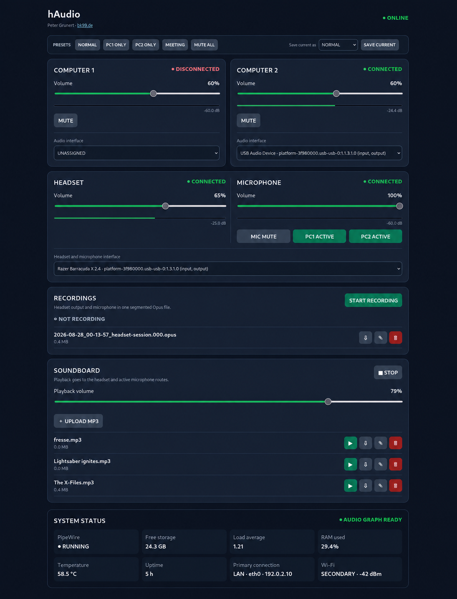

# hAudio 0.01 – Audio Routing for Two Computers

Date: 2026-08-27  
Author: Peter Grunert  
Website: <https://www.bk99.de>  
License: GNU General Public License v3.0 or later (GPL-3.0-or-later)

hAudio is a permanently running Raspberry Pi audio-routing system. It mixes
audio from PC1 and PC2 to a wireless headset and routes the headset microphone
independently to PC1, PC2, both, or neither computer.

## Signal paths

~~~text
PC1 -> USB audio interface A --------------┐
                                           ├-> PipeWire mix -> USB headset adapter -> headset
PC2 -> USB audio interface B --------------┘

Headset microphone -> USB headset adapter -> PipeWire -> PC1 and/or PC2
~~~

## Optional hardware examples

hAudio is designed to work with compatible USB audio adapters and 3.5 mm
audio cables; the exact brands and models are not required. The following
links are examples of hardware used for this type of setup:

- [USB audio adapters](https://amzn.to/4xrTc1R)
- [3.5 mm AUX audio cables](https://amzn.to/4hZ3JfU)

These are affiliate links. If you buy through one of them, the maintainer may
receive a commission at no additional cost to you. Product links are optional;
equivalent compatible hardware can be used. As an Amazon Associate I earn
from qualifying purchases.

Identical USB audio interfaces are distinguished by their physical USB paths
or by explicit assignments in the web interface. ALSA card numbers and USB
device numbers are not permanent identifiers. Any compatible headset adapter
can be selected for the headset role.

## Included files

- opt/haudio/haudio_main.py – FastAPI backend, PipeWire control, device
  monitoring, web interface, level meters, soundboard, and recording
- etc/systemd/system/haudio-control.service – automatic backend start/restart
- etc/pipewire/pipewire.conf.d/haudio.conf – 48 kHz audio parameters
- docs/ – installation, operations, and current-state documentation
- requirements.txt and requirements-dev.txt – runtime and test dependencies
- tests/ – automated unit tests for safety-critical helper logic

Runtime state, recordings, credentials, and private SSH keys are not included.

## Quick installation

On a Raspberry Pi running Raspberry Pi OS or Debian, create the `haudio` service
user and install the required system packages (PipeWire, WirePlumber, FFmpeg,
Python 3, FastAPI, and Uvicorn). Then copy the files from this repository:

~~~bash
sudo install -d /opt/haudio
sudo install -o haudio -g haudio -m 755 opt/haudio/haudio_main.py /opt/haudio/haudio_main.py
sudo install -D -m 644 etc/systemd/system/haudio-control.service /etc/systemd/system/haudio-control.service
sudo install -D -o haudio -g haudio -m 644 etc/pipewire/pipewire.conf.d/haudio.conf \
  /home/haudio/.config/pipewire/pipewire.conf.d/haudio.conf
sudo python3 -m py_compile /opt/haudio/haudio_main.py
sudo systemctl daemon-reload
sudo systemctl enable --now haudio-control.service
~~~

Open the web interface at `http://<raspberry-pi-address>:8765`. See
`docs/INSTALL.md` for backups, verification, and recovery details.

## Development and tests

Install runtime and development dependencies with `pip install -r
requirements-dev.txt`, then run:

~~~bash
python3 -m py_compile opt/haudio/haudio_main.py
pytest -q
~~~

The tests cover device assignment, loopback cleanup filtering, filename
validation, runtime environment handling, and the installation configuration.

## Web interface

The responsive web interface provides independent computer volume and mute
controls, microphone routing, live level meters, recording management,
hardware assignment, and a soundboard.

The screenshot is an example deployment. Device names and assignments vary
depending on the hardware connected to the Raspberry Pi.

The endpoint reference is available in [docs/API.md](docs/API.md).

## Recording and soundboard

The web interface provides one combined recording containing headset output and
headset microphone, stored as segmented Opus files under
/data/haudio/recordings/YYYY-MM-DD/. Recordings can be started, stopped,
downloaded, renamed, and deleted.

MP3 files can be uploaded, played, downloaded, renamed, and deleted. Playback
uses a dedicated PipeWire mix bus and is sent to the headset and non-muted
computer outputs. Both features work independently of the browser.

## Device assignment

Currently detected USB audio cards can be assigned to PC1, PC2, and
headset/microphone roles in the web interface. Assignments are stored
persistently and the audio graph is rebuilt from the selected PipeWire cards.

## Current operation

- Web interface: `http://<raspberry-pi-address>:8765`
- Service: `haudio-control.service`
- Service user: `haudio`
- PipeWire runtime: `/run/user/<service-uid>`
- Logs: `journalctl -u haudio-control.service -f`

Audio processing runs independently of the browser. USB capture gain is reset
to a safe level during startup and device recovery to prevent clipping.
The Raspberry Pi undervoltage warning display is suppressed with
avoid_warnings=1; kernel undervoltage detection remains enabled.
